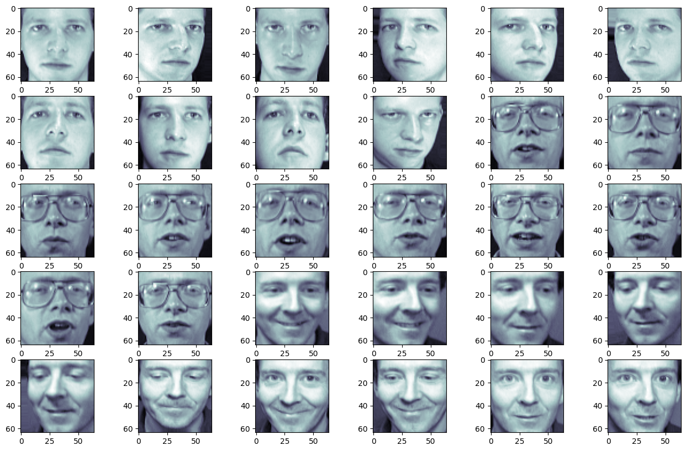
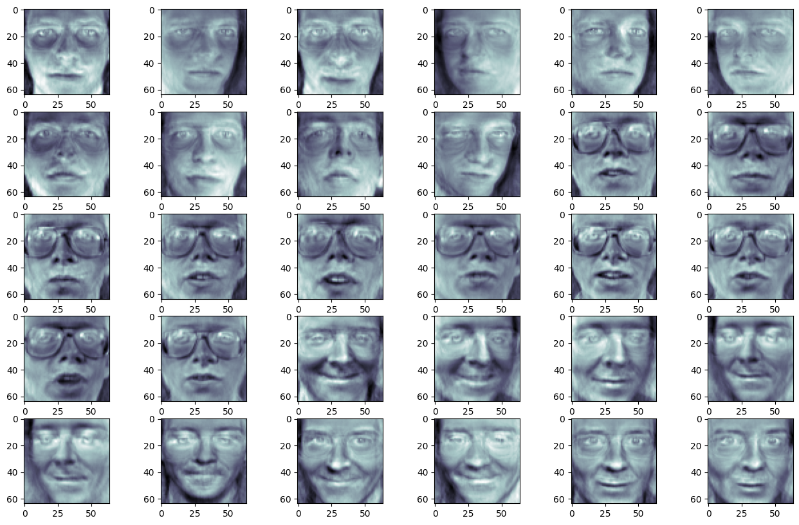
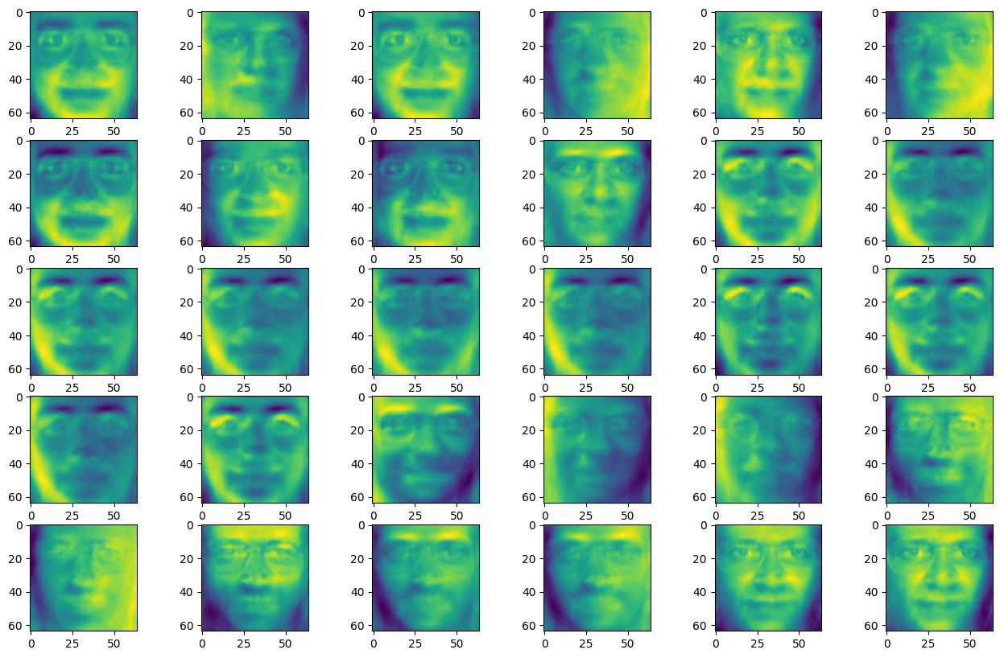
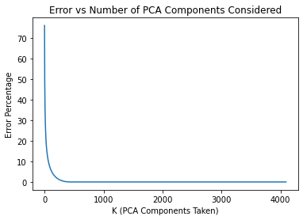

# Feature Compression using PCA and SVD in Images from Scratch

- Performed lossy compression using PCA and using SVD from scratch on images with varying number of principal components.
- Generated Eigen Faces from Olivetti dataset using PCA with different number of eigen values.

#### Dataset
- [Olivetti Face Images](https://www.cl.cam.ac.uk/research/dtg/attarchive/facedatabase.html): 400 images of 40 distinct people, each 64x64 grey-scale images.

#### Output with Top-123 Eigen Values: 5% Error

#### Output with Top-5 Eigen Values

#### Error vs Number of PCA Components Considered

## Contributions
[Saurabh Chatterjee](https://github.com/chatterjeesaurabh)  
MTech, Signal Processing and Machine Learning  
Indian Institute of Technology (IIT) Kharagpur
